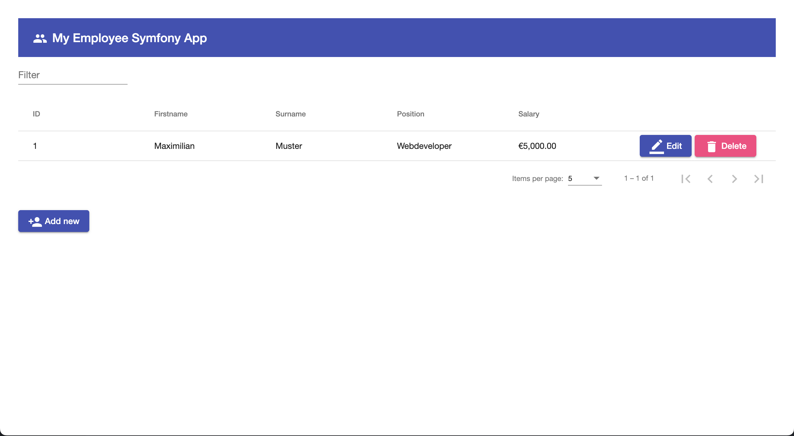

# Angular Symfony Api Frontend

This is a Symfony Angular Frontend based on Github SymfonyApi Repository.

The project includes a frontend build with Angular Material.

This project was generated with [Angular CLI](https://github.com/angular/angular-cli) version 14.0.5.

## Prerequisites

```js
git clone https://github.com/bmehler/symfony-frontend-angular.git
cd <Directory>
npm install
```

## Screenshot



## Development server

Run `ng serve` for a dev server. Navigate to `http://localhost:4200/`. The application will automatically reload if you change any of the source files.

## Running unit tests

Run `ng test` to execute the unit tests via [Karma](https://karma-runner.github.io).

## Further help

To get more help on the Angular CLI use `ng help` or go check out the [Angular CLI Overview and Command Reference](https://angular.io/cli) page.
